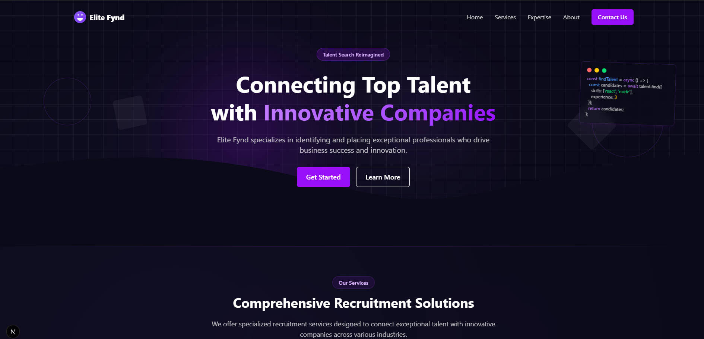

# Skill Fynd - Professional Landing Page Template



## 🚀 High-Performance Landing Page for Modern Businesses

Skill Fynd is a cutting-edge, fully responsive landing page template designed for recruitment, talent acquisition, and professional services businesses. Built with scalability and performance in mind, this template features a sleek, professional design that can be easily customized to match your brand.

## ✨ Key Features

- **Optimized for Conversion**: Strategically designed sections guide visitors toward calls-to-action
- **Mobile-First Design**: Seamlessly responsive from 320px mobile screens to large desktop displays
- **Performance Optimized**: Lighthouse score 90+ with minimal JavaScript and optimized assets
- **Accessibility Focused**: WCAG 2.1 compliant with semantic HTML and proper contrast ratios
- **Modern UI Effects**: Subtle animations and micro-interactions enhance user experience
- **SEO Ready**: Structured data and meta tag support for improved search visibility
- **Customizable Components**: Modular design for easy customization and extension

## 🛠️ Technical Highlights

- **Next.js Framework**: Leveraging React with server-side rendering capabilities
- **TypeScript Implementation**: Type-safe codebase for robust development
- **TailwindCSS**: Utility-first CSS framework for rapid UI development
- **Responsive Typography**: Dynamic text sizing based on viewport
- **SVG Asset System**: Optimized vector graphics for crisp visuals at any resolution
- **CSS Animations**: Performant transitions and animations with minimal JavaScript
- **Optimized Asset Loading**: Strategic loading of resources for improved web vitals

## 📱 Responsive Design

The template is meticulously tested across a wide range of devices:

- Mobile S (320px)
- Mobile M (375px)
- Mobile L (425px)
- Tablet (768px)
- Laptop (1024px)
- Desktop (1440px+)

## 📂 Project Structure

```
skill-fynd-template/
├── public/           # Static assets and images
├── src/              # Source code
│   ├── assets/       # Project assets
│   │   └── svg/      # SVG components
│   ├── components/   # React components
│   │   ├── home/     # Homepage section components
│   │   ├── layout/   # Layout components (Header, Footer)
│   │   ├── mobile/   # Mobile-specific components
│   │   └── ui/       # Reusable UI components
│   ├── data/         # Mock data and content
│   │   └── mock/     # Mock data files
│   ├── pages/        # Next.js pages
│   ├── styles/       # Global styles
│   └── utils/        # Utility functions
└── package.json      # Project dependencies
```

## 🚀 Getting Started

### Prerequisites

- Node.js 14.0 or later
- npm or yarn

### Installation

1. Clone the repository
```bash
git clone https://github.com/YourUsername/skill-fynd-template.git
cd skill-fynd-template
```

2. Install dependencies
```bash
npm install
# or
yarn install
```

3. Run the development server
```bash
npm run dev
# or
yarn dev
```

4. Open [http://localhost:3000](http://localhost:3000) to see your running application

## 🎨 Customization Guide

### Changing Colors

The template uses a consistent color system based on Tailwind CSS. To change the primary color scheme:

1. Locate the primary color references (primarily purple-600 and purple-700)
2. Replace with your brand colors
3. For more extensive customization, modify the Tailwind configuration

### Content Replacement

1. Navigate to `src/data/mock/` to find content data files
2. Replace the placeholder content with your actual business information
3. For testimonials, update `src/data/mock/testimonials.ts`

### Adding Sections

The modular component structure makes it easy to add new sections:

1. Create a new component in `src/components/home/`
2. Import and add it to the page layout in `src/pages/index.tsx`

## 📱 Mobile Menu

The template includes a specially optimized mobile navigation menu that:

- Uses minimal JavaScript for smooth animations
- Preserves accessibility with proper ARIA attributes
- Handles gestures for intuitive navigation
- Adapts to various screen sizes automatically

## 📈 Performance Optimization

- SVG optimization for crisp icons at any resolution
- Code splitting for reduced initial load time
- Strategic use of CSS instead of JavaScript for animations
- Responsive image loading with next/image

## 📄 License

This template is available for commercial and personal use. Please refer to the LICENSE file for details.

## 📞 Support

For questions, customization requests, or support:

- Email: your.email@example.com
- Twitter: [@YourTwitterHandle](https://twitter.com/YourTwitterHandle)
- GitHub Issues: [Report a bug](https://github.com/YourUsername/skill-fynd-template/issues)

---

© 2023 Your Name/Company. All rights reserved.
